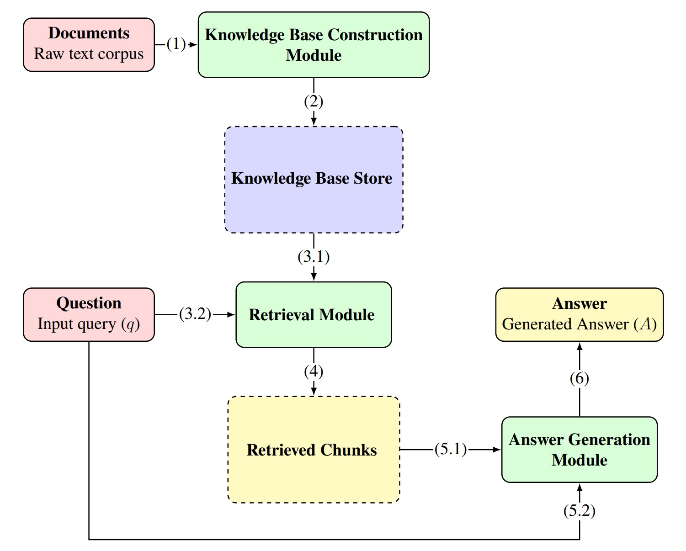
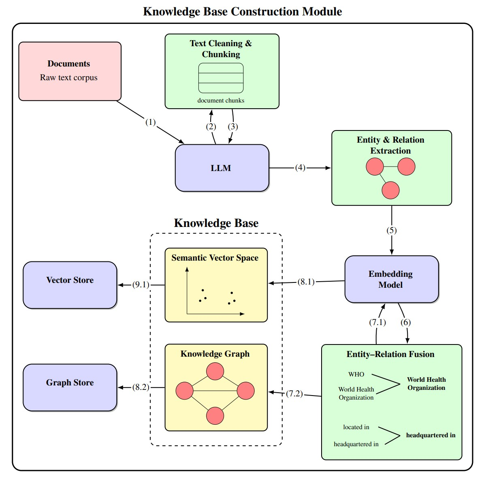
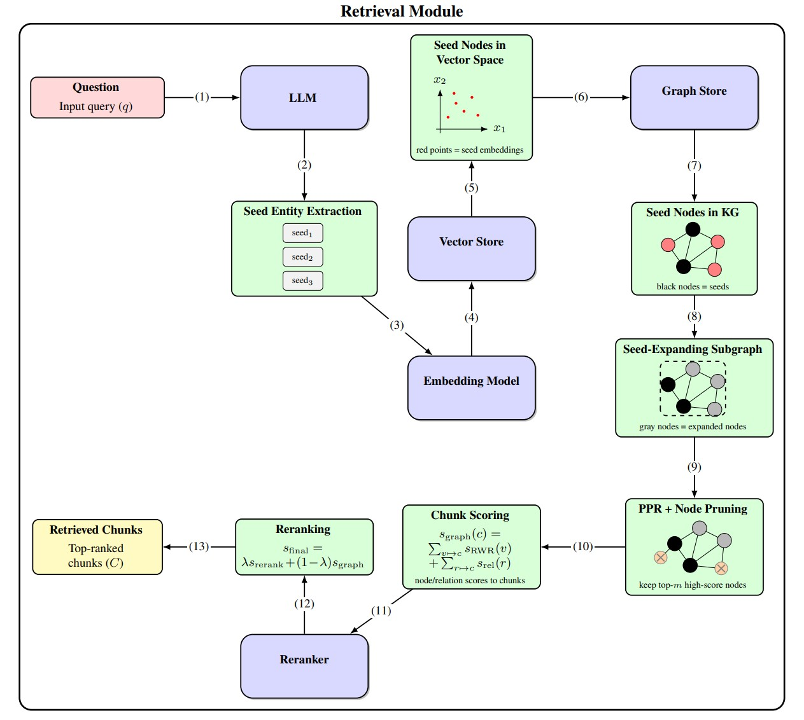
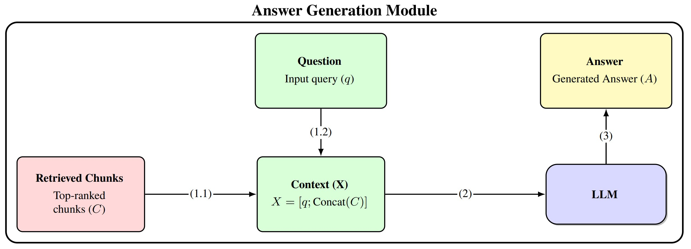

# Improving Knowledge Retrieval in Medical QA with GraphRAG

<div align="center">

[](https://opensource.org/licenses/MIT)
[](https://www.python.org/downloads/)
[](https://jupyter.org/)
[](https://www.kaggle.com/)

A GraphRAG-based medical question answering pipeline focused on improving knowledge retrieval.


</div>

---

## Overview

This project investigates and improves knowledge retrieval for medical question answering using a GraphRAG-based approach.

The system constructs a knowledge base from medical documents by extracting and deduplicating entities and relations, then stores the resulting knowledge in both a knowledge graph and a vector store.

For each question, the system extracts entities, resolves them to graph nodes, constructs relevant subgraphs, applies Personalized PageRank algorithm (PPR) to identify relevant nodes, converts graph information back into text chunks, and reranks them to get retrieved chunks for answer generation phase.

The system is evaluated on a medical QA dataset covering three question types: Fact Retrieval, Complex Reasoning, and Contextual Summarize.

---

## Overall Architecture

<p align="center">
  
</p>


### 🧠 Knowledge Base Construction

<p align="center">
  
</p>


- Medical document preprocessing and sentence-based chunking
- Entity and relation extraction using an LLM
- Entity deduplication based on lexical and semantic similarity
- Knowledge graph construction
- Vector representation of entities and relations

### 🔍 Information Retrieval


<p align="center">
  
</p>

- In-query entity extraction using an LLM 
- Vector-based entity resolution
- Query-focused subgraph construction
- Personalized PageRank (PPR) for graph-based relevance scoring
- Chunk-level relevance scoring
- Reranking for final context selection

### 🤖 Answer Generation

<p align="center">
  
</p>

- Context construction from retrieved chunks
- Question answering using the retrieved knowledge
- LLM for answer generation 

### 📊 Evaluation

| Metric | Purpose | Fact Retrieval | Complex Reasoning | Contextual Summarize |
|---|---|:---:|:---:|:---:|
| **Evidence Recall** | Retrieved contexts cover the required evidence | ✓ | ✓ | ✓ |
| **Context Relevance** | Retrieved contexts are relevant to the question and evidence | ✓ | ✓ | ✓ |
| **ROUGE-L** | Lexical similarity between generated and reference answers | ✓ | ✓ | — |
| **Answer Accuracy (ACC)** | Factual and semantic similarity to the reference answer | ✓ | ✓ | ✓ |
| **Evidence Coverage (Cov)** | Completeness of information covered in the generated answer | — | — | ✓ |
---

## Environment

- **Kaggle:** Used to run the main RAG pipeline, including knowledge base construction and information retrieval.
- **Local:** Answer generation and evaluation were performed locally to ensure a consistent answer-generation model and evaluation setup.

---

## Models

| Model | Role |
|---|---|
| **Qwen2.5-7B-Instruct** | Entity/relation extraction and query entity extraction (seed entities) |
| **BAAI/bge-large-en-v1.5** | Entity/relation embedding |
| **BAAI/bge-reranker-v2-m3** | Chunk re-ranking |
| **GPT-4o-mini** | Answer generation and LLM-as-a-judge evaluation |

---

## Experimental Results

### Retrieval Results

| Metric            | Fact Retrieval | Complex Reasoning | Contextual Summarize |
| ----------------- | -------------: | ----------------: | -------------------: |
| Evidence Recall   |     **88.33%** |        **90.00%** |           **90.66%** |
| Context Relevance |     **74.34%** |        **65.91%** |           **75.69%** |


| Method | FR Recall | FR Relevance | CR Recall | CR Relevance | CS Recall | CS Relevance |
|---|---:|---:|---:|---:|---:|---:|
| RAG (w/o rerank) | 86.24 | 63.71 | 84.97 | 84.11 | 84.14 | 89.94 |
| RAG (w/ rerank) | 87.83 | 64.73 | 86.49 | **85.56** | 85.87 | **91.35** |
| MS-GraphRAG (local) | 38.06 | 5.67 | 61.32 | 4.25 | 59.66 | 5.24 |
| MS-GraphRAG (global) | 65.98 | 7.46 | 78.46 | 11.72 | 89.06 | 11.72 |
| HippoRAG | 87.25 | 52.44 | 83.80 | 42.19 | 83.46 | 49.13 |
| HippoRAG2 | 78.70 | **87.96** | 77.00 | 80.94 | 77.40 | 86.85 |
| LightRAG | 80.32 | 41.27 | 82.91 | 42.79 | 85.71 | 43.11 |
| Fast-GraphRAG | 66.82 | 45.86 | 74.93 | 38.80 | 77.27 | 47.58 |
| RAPTOR | 85.40 | 69.38 | 89.70 | 53.20 | 88.86 | 58.73 |
| Lazy-GraphRAG | 74.29 | 19.90 | 78.65 | 17.50 | 78.72 | 21.35 |
| KGP | 57.51 | 27.34 | 53.51 | 26.59 | 59.38 | 56.20 |
| StructRAG | 63.25 | 37.26 | 61.75 | 35.68 | 62.55 | 32.01 |
| KET-RAG | 86.44 | 57.07 | 80.62 | 30.86 | 89.07 | 44.59 |
| **Proposed Method** | **88.33** | 74.34 | **90.00** | 65.91 | **90.66** | 75.69 |

> FR: Fact Retrieval · CR: Complex Reasoning · CS: Contextual Summarize

For information retrieval, the proposed method achieves the highest Evidence Recall across all three question types, reaching 88.33% for Fact Retrieval, 90.00% for Complex Reasoning, and 90.66% for Contextual Summarize.


### Generation Results

| Metric            | Fact Retrieval | Complex Reasoning | Contextual Summarize |
| ----------------- | -------------: | ----------------: | -------------------: |
| Answer Accuracy   |     **66.28%** |        **63.78%** |           **71.76%** |
| ROUGE-L           |     **40.51%** |        **24.13%** |                    — |
| Evidence Coverage |              — |                 — |           **49.29%** |


| Method | FR ACC | FR ROUGE-L | CR ACC | CR ROUGE-L | CS ACC | CS Cov |
|---|---:|---:|---:|---:|---:|---:|
| RAG (w/o rerank) | 63.72 | 29.21 | 57.61 | 13.98 | 63.72 | 77.34 |
| RAG (w/ rerank) | 64.73 | 30.75 | 58.64 | 15.57 | 65.75 | **78.54** |
| MS-GraphRAG (local) | 38.63 | 26.80 | 47.04 | 21.99 | 41.87 | 22.98 |
| MS-GraphRAG (global) | 16.42 | **46.00** | 15.61 | **52.75** | 19.82 | — |
| HippoRAG | 56.14 | 20.95 | 55.87 | 13.57 | 59.86 | 62.73 |
| HippoRAG2 | **66.28** | 36.69 | 61.98 | 36.97 | 63.08 | 46.13 |
| LightRAG | 63.32 | 37.19 | 61.32 | 24.98 | 63.14 | 51.16 |
| Fast-GraphRAG | 60.93 | 31.04 | 61.73 | 21.37 | 67.88 | 52.07 |
| RAPTOR | 54.07 | 17.93 | 53.20 | 11.73 | 58.73 | 78.28 |
| Lazy-GraphRAG | 60.25 | 31.66 | 47.82 | 22.68 | 57.28 | 55.92 |
| KGP | 52.34 | 21.34 | 51.53 | 11.69 | 54.51 | 62.40 |
| StructRAG | 55.38 | 27.53 | 56.17 | 22.79 | 62.48 | 65.66 |
| KET-RAG | 60.35 | 31.99 | 39.56 | 19.52 | 45.27 | 29.04 |
| **Proposed Method** | 64.63 | 40.51 | **63.78** | 24.13 | **71.76** | 49.29 |

> FR: Fact Retrieval · CR: Complex Reasoning · CS: Contextual Summarize


For answer generation, the proposed method achieves the best ACC for Complex Reasoning and Contextual Summarize, while also obtaining the highest ROUGE-L for Fact Retrieval.

---

## Folder Structure

```
medical-graphrag/
├── README.md                          # Project documentation 
├── requirements.txt                   # Python dependencies
├── MANUAL.md                          # Running manual
│
├── rag_pipeline.ipynb                 # Jupyter notebook with full pipeline
│
├── Datasets/                          # Data directory
│   ├── Corpus/                        # Knowledge base documents
│   │   ├── medical.json               # Medical documents (json type)
│   │   ├── medical.parquet            # Medical documents (parquet type)
│   │   └── medical.txt                # Plain text medical corpus 
│   │
│   └── Questions/                     # Evaluation questions
│       ├── medical_questions.json     # Medical QA pairs with meta data (json type)
│       ├── medical_questions.parquet  # Medical QA pairs with meta data (parquet type)
│       └── medical_questions.txt      # Plain text medical questions 
│
├── Generation/                        # Answer generation module
│   ├── __init__.py
│   ├── answer_generation_base.py      # Core generation logic
│   ├── input/
│   │   └── generation_input_data.json # Input data for generation
│   └── output/
│       └── generation_eval_data.json  # Generated answers output
│
├── Evaluation/                        # Evaluation metrics module
│   ├── __init__.py
│   ├── README.md                      # Evaluation-specific documentation
│   ├── generation_eval.py             # Generation quality evaluation
│   ├── retrieval_eval.py              # Retrieval quality evaluation
│   ├── indexing_eval.py               # Indexing quality evaluation
│   │
│   ├── llm/                           # LLM clients
│   │   ├── __init__.py
│   │   └── ollama_client.py          # Ollama integration
│   │
│   └── metrics/                       # Evaluation metrics
│       ├── __init__.py
│       ├── answer_accuracy.py         # Answer accuracy metric
│       ├── context_relevance.py       # Context relevance metric
│       ├── context_relevance_v2.py    # Context relevance metric v2
│       ├── coverage.py                # Evidence coverage metric
│       ├── evidence_recall.py         # Evidence recall metric
│       ├── rouge.py                   # ROUGE-L metric
│       └── utils.py                   # Metric utility functions
│
├── evaluate_data/                     # Evaluation dataset storage
│   ├── retrieval_eval_data.json      # Retrieval evaluation inputs
│   └── generation_eval_data.json     # Generation evaluation inputs
│
└── evaluate_result/                   # Evaluation results
    ├── retrieval_eval_result.json    # Retrieval evaluation results
    └── generation_eval_results.json  # Generation evaluation results
```

---

## License

This project is licensed under the **MIT License** - see the [LICENSE](LICENSE) file for details.

### Third-Party Components

This project incorporates components from:

- **GraphRAG-Benchmark**: Evaluation metrics and datasets
  - Repository: https://github.com/GraphRAG-Bench/GraphRAG-Benchmark
  - License: MIT
  - Modified: Yes (adapted for this project)

### Attribution

When using this project in research or production, please cite:

```bibtex
@thesis{phamlongkhanhrag2026,
  title  = {Nghiên cứu và cải thiện hiệu quả truy xuất tri thức trong hệ thống hỏi đáp y khoa dựa trên GraphRAG},
  author = {Pham Long Khanh},
  year   = {2026},
  school = {Hanoi University of Science and Technology},
}
```

